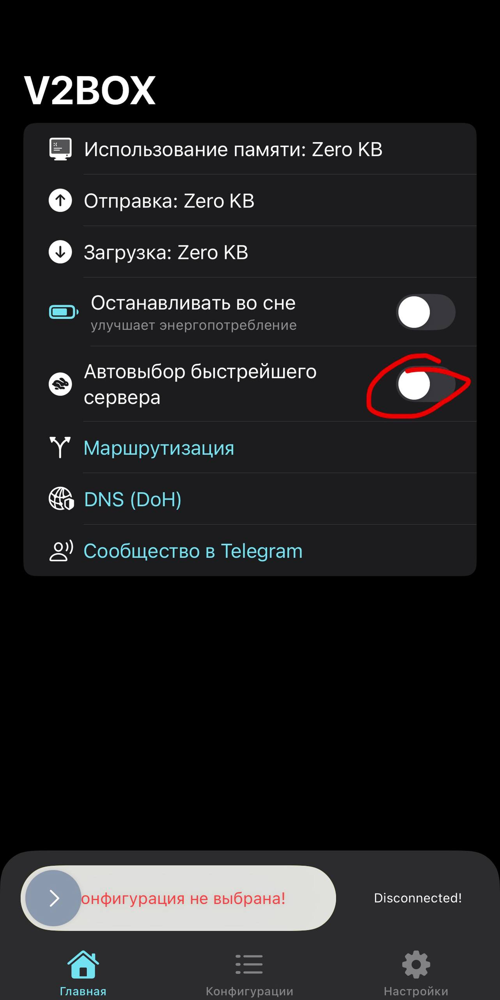
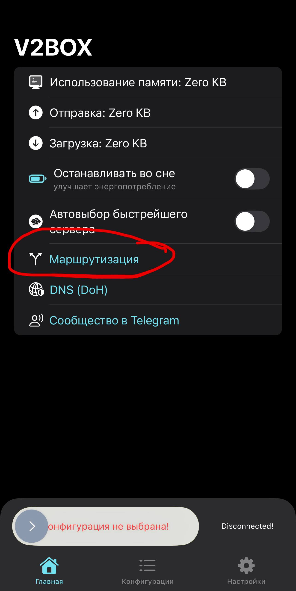
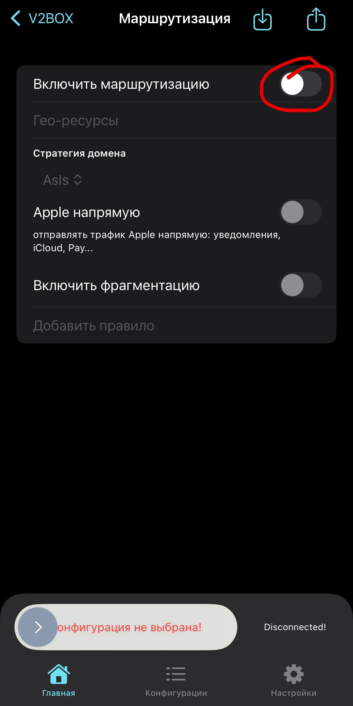
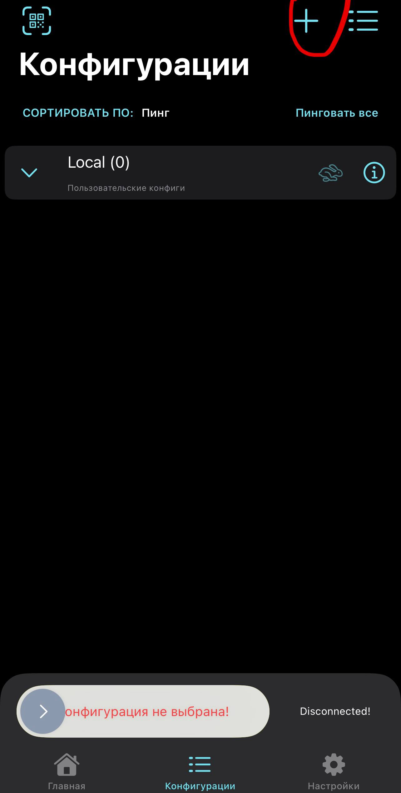
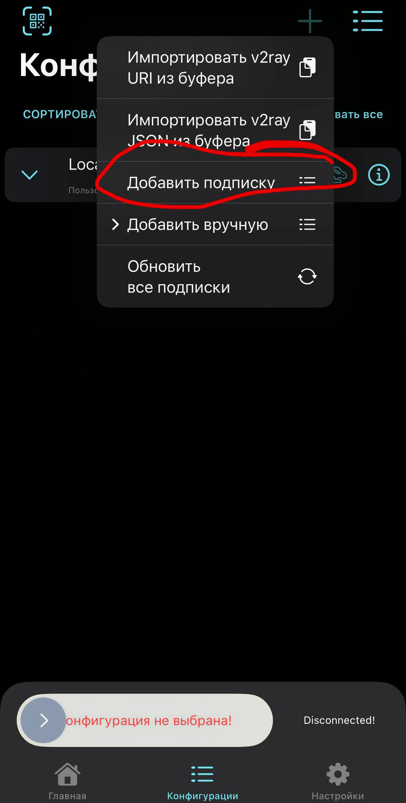

В этом разделе представлена пошаговая инструкция с визуальным сопровождением по настройке Terminator VPN на Windows
---

### 0. 

По ссылке (https://apps.apple.com/ru/app/v2box-v2ray-client/id6446814690) скачайте v2raybox

---

---

### 1. 
Включите тумблер автоподключения к самому быстрому серверу

---

### 2.
Зайдите в пункт маршрутизация
  

---

### 3.
Включите маршрутизацию

---

### 4.
Перейдите в конфигурации и нажмите на "плюс"

---

### 5.
Нажмите "Добавить подписку"

---

### 6.
* Введите любое желаемое имя
* Вставьте ссылку которую вам прислал бот
* Нажмите "Добавить источник"

---

### 7.
* Нажмите "Пинговать все"
* Выберите сервер с минимальным пингом
* Свайпните снизу для подключения

---
